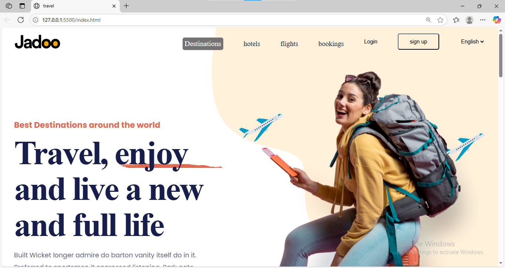
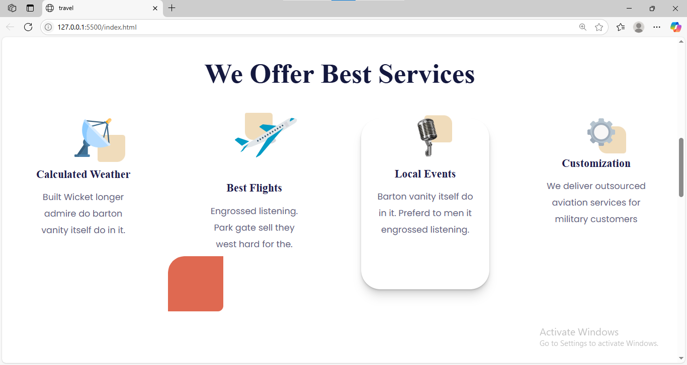
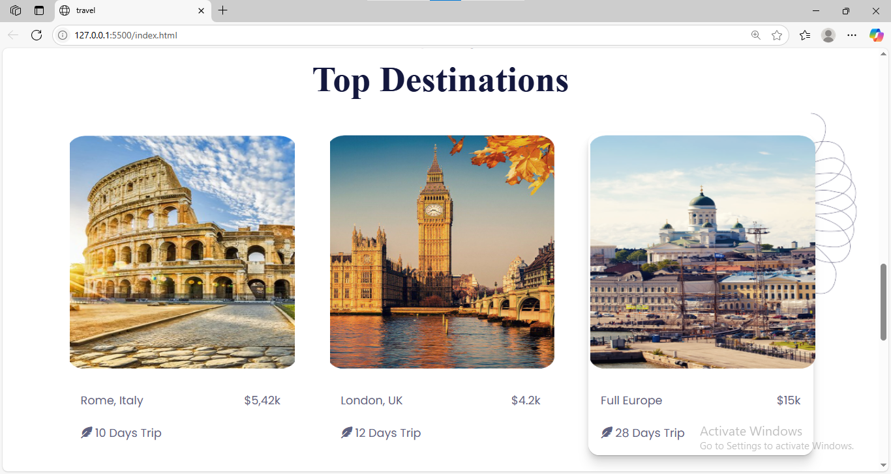

# 🌍 Travel Landing Page

A sleek travel website landing page built using pure HTML and CSS. This project is part of my journey to sharpen front-end development skills and explore user-friendly, visually appealing web design.

---
## ✨ Features

- 🎨 Clean and modern UI with engaging visuals
- 🧭 Navigation bar with smooth layout structure
- 💡 Hover effects and styling for interactivity
- 💻 Built using only HTML5 and CSS3 (no frameworks)

---
## 📸 Demo

